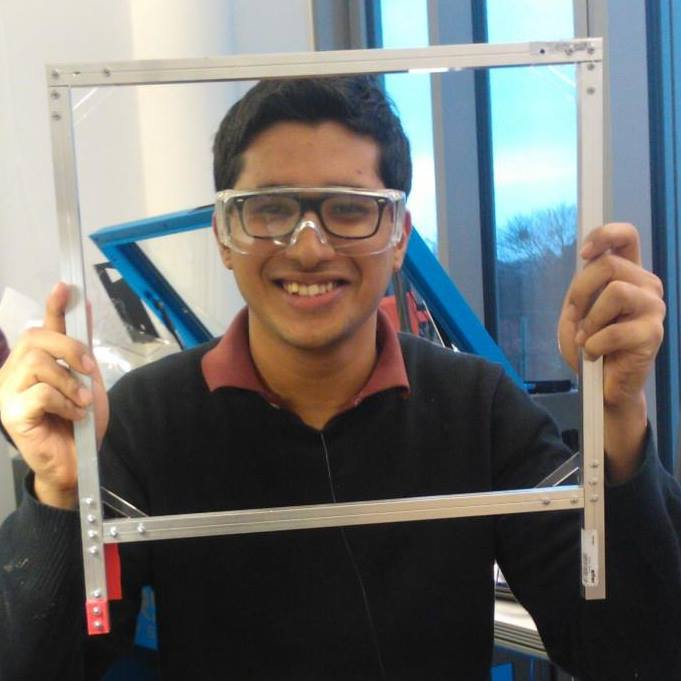



   
I'm a research fellow working with <a href="http://research.microsoft.com/en-us/um/people/thies/">Bill Thies</a> at the <a href="http://research.microsoft.com/en-us/groups/tem/">Technologies for Emerging Markets group </a> in Microsoft Researh India. 
   Prior to this, I graduated with a masters from both Universite Paris-Sud and TU-Berlin. 
 During my masters, I worked as a research assistant and finished my thesis with <a href="http://www.patrickbaudisch.com/"> Prof. Patrick Baudisch </a> and <a href="http://stefaniemueller.org/">Stefanie Mueller</a> in the <a href="http://hpi.de/baudisch/home.html"> HCI lab </a> at <a href="http://hpi.de"> Hasso-Plattner Institut</a>. 
   I also interned at several other interesting research labs such as <a href="http://www.xrce.xerox.com/Research-Development/Services-Innovation-Laboratory/Work-Practice-Technology/Approach">work practice technology</a> group at <a href="http://www.xrce.xerox.com">Xerox Research</a>, <a href="http://www.aviz.fr">Analytics and visualization (Aviz)</a> lab at <a href="http://www.inria.fr/centre/saclay">INRIA-Saclay</a> and in the <a href="http://www.globis.ethz..ch/research/index">Global Information Systems </a> group at <a href="https://www.ethz.ch/en.html">ETH Zurich</a>.

   
 My broad research area is <a href="http://en.wikipedia.org/wiki/Human%E2%80%93computer_interaction">Human–computer interaction</a>. I am interested in understanding how interactive computing can meaningfully impact the lives of people who are marginalized and underserved in the society, e.g, how computing can affect areas like health and education for people living in developing regions, people with disability, etc.

              


	