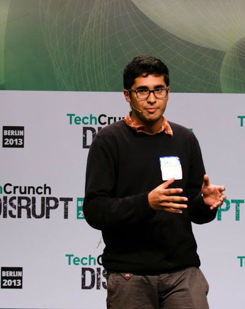



   
I'm currently a masters student at both Universite Paris-Sud and TU-Berlin. Currently, I am doing an internship at Xerox Research in the beautiful city of Grenoble.

   
Previously I was a research intern in the <a href="http://www.aviz.fr">AVIZ</a> group at  <a href="http://www.inria.fr/centre/saclay">INRIA-Saclay</a> and in the <a href="http://www.globis.ethz.ch/research/index">Global Information Systems </a> group at <a href="https://www.ethz.ch/en.html">ETH Zurich</a>.
 
 My broad research area is <a href="http://en.wikipedia.org/wiki/Human%E2%80%93computer_interaction">Human–computer interaction</a>. I’m excited to be a part of research ventures that help extend users capabilities by developing novel tools and techniques.

              


